# 🚀 Umsetzungsplan: YouTube MCP Server Enhancement

**Projekt:** youtube-data-mcp-server
**Ziel:** Feature-Parität mit youtube-mcp-server + Optimierung bestehender Implementierung
**Geschätzter Gesamtaufwand:** 8-10 Stunden
**Datum:** 2025-11-07

---

## 📊 Executive Summary

### Aktuelle Situation
- ✅ **9 Tools implementiert** mit überlegener Bulk-Operation und Pagination
- ✅ **Moderne Transcript-Library** (youtube-caption-extractor)
- ⚠️ **Fehlende Features:** Playlist-Management, erweiterte Transcript-Features
- ⚠️ **Technische Schuld:** Error Handling, fehlende Lazy Initialization

### Ziel-Zustand
- 🎯 **16+ Tools** (7 neue Tools)
- 🎯 **Robuste Fehlerbehandlung** in allen Methoden
- 🎯 **Optimierte Architektur** (Lazy Init, bessere Patterns)
- 🎯 **100% Feature-Parität** + unsere Unique Features behalten

---

## 📈 Implementierungs-Roadmap

```mermaid
gantt
    title Implementation Roadmap
    dateFormat  HH:mm
    section Phase 1: Quick Wins
    Error Handling       :a1, 00:00, 15m
    searchTranscript     :a2, after a1, 30m
    getTimestampedCaptions :a3, after a2, 15m

    section Phase 2: Architecture
    Lazy Initialization  :b1, after a3, 60m
    getChannel Extension :b2, after b1, 30m

    section Phase 3: Playlists
    Playlist Class       :c1, after b2, 120m
    Playlist Tools       :c2, after c1, 60m

    section Phase 4: Advanced
    Channel Extensions   :d1, after c2, 90m
    Final Testing        :d2, after d1, 60m
```



---

## 🎯 Phase 1: Quick Wins (1 Stunde)

**Ziel:** Schnelle Verbesserungen mit hohem Impact
**Aufwand:** 1 Stunde
**Priorität:** 🔴 CRITICAL

### Task 1.1: Verbessertes Error Handling (15 Min)

**Problem:** Aktuelles Error Handling verwendet `error: any` und kann crashen

**Betroffene Dateien:**
- `src/functions/videos.ts` (alle catch-Blöcke)

**Änderungen:**
```typescript
// VORHER (11 Stellen)
catch (error: any) {
  throw new Error(`Failed: ${error.message}`);
}

// NACHHER
catch (error) {
  throw new Error(
    `Failed: ${error instanceof Error ? error.message : String(error)}`
  );
}
```

**Checkliste:**
- [ ] `getVideo()` - Zeile 53
- [ ] `searchVideos()` - Zeile 86
- [ ] `getTranscript()` - Zeile 102
- [ ] `getRelatedVideos()` - Zeile 121
- [ ] `getChannelStatistics()` - Zeile 144
- [ ] `getChannelTopVideos()` - Zeile 207
- [ ] `getVideoEngagementRatio()` - Zeile 238
- [ ] `getTrendingVideos()` - Zeile 266
- [ ] `compareVideos()` - Zeile 290

**Test:**
```bash
npm run build
# Sollte ohne TypeScript-Fehler kompilieren
```

---

### Task 1.2: searchTranscript() implementieren (30 Min)

**Ziel:** Suche innerhalb von Video-Transcripts

**Datei:** `src/functions/videos.ts`

**Neue Methode:**
```typescript
/**
 * Search within a video transcript for specific terms
 * @param videoId - YouTube video ID
 * @param query - Search term (case-insensitive)
 * @param lang - Language code (optional)
 * @returns Matching transcript segments with timestamps
 */
async searchTranscript(videoId: string, query: string, lang?: string) {
  try {
    const transcript = await this.getTranscript(videoId, lang);

    const queryLower = query.toLowerCase();
    const matches = transcript.filter(item =>
      item.text.toLowerCase().includes(queryLower)
    );

    return {
      videoId,
      query,
      language: lang || process.env.YOUTUBE_TRANSCRIPT_LANG || 'en',
      matchCount: matches.length,
      matches: matches.map(item => ({
        start: item.start,
        duration: item.dur,
        text: item.text,
        // Add context highlighting
        highlightedText: item.text.replace(
          new RegExp(query, 'gi'),
          (match) => `**${match}**`
        )
      }))
    };
  } catch (error) {
    throw new Error(
      `Failed to search transcript for video ${videoId}: ${
        error instanceof Error ? error.message : String(error)
      }`
    );
  }
}
```

**Interface hinzufügen:**
```typescript
export interface SearchTranscriptOptions {
  videoId: string;
  query: string;
  lang?: string;
}
```

**MCP Tool registrieren in `src/index.ts`:**
```typescript
// Nach getTranscripts Tool (ca. Zeile 179)
server.tool("searchTranscript",
  "Search within a video's transcript for specific terms or phrases. Returns matching segments with timestamps and highlighted text. Useful for finding specific mentions, quotes, or topics within videos.",
  {
    videoId: z.string(),
    query: z.string(),
    lang: z.string().optional()
  },
  async ({ videoId, query, lang }: SearchTranscriptOptions) => {
    try {
      const result = await videoManager.searchTranscript(videoId, query, lang);
      return {
        content: [{ type: "text", text: JSON.stringify(result, null, 2) }]
      };
    } catch (error: any) {
      return {
        content: [{
          type: "text",
          text: JSON.stringify({
            error: error instanceof Error ? error.message : String(error)
          }, null, 2)
        }]
      };
    }
  }
);
```

**Test:**
```typescript
// Manueller Test
const result = await videoManager.searchTranscript('3kbiGPn0cOo', 'AI', 'en');
console.log(result.matchCount); // Sollte > 0 sein
```

---

### Task 1.3: getTimestampedCaptions() implementieren (15 Min)

**Ziel:** Menschenlesbare Timestamps (MM:SS Format)

**Datei:** `src/functions/videos.ts`

**Neue Methode:**
```typescript
/**
 * Get transcript with human-readable timestamps
 * @param videoId - YouTube video ID
 * @param lang - Language code (optional)
 * @returns Transcript with formatted timestamps
 */
async getTimestampedCaptions(videoId: string, lang?: string) {
  try {
    const transcript = await this.getTranscript(videoId, lang);

    return transcript.map(item => {
      const startSeconds = parseFloat(item.start);
      const minutes = Math.floor(startSeconds / 60);
      const seconds = Math.floor(startSeconds % 60);
      const milliseconds = Math.floor((startSeconds % 1) * 1000);

      return {
        timestamp: `${minutes}:${String(seconds).padStart(2, '0')}`,
        timestampMs: `${minutes}:${String(seconds).padStart(2, '0')}.${String(milliseconds).padStart(3, '0')}`,
        text: item.text,
        startSeconds: startSeconds,
        durationSeconds: parseFloat(item.dur)
      };
    });
  } catch (error) {
    throw new Error(
      `Failed to get timestamped captions for video ${videoId}: ${
        error instanceof Error ? error.message : String(error)
      }`
    );
  }
}
```

**MCP Tool registrieren:**
```typescript
server.tool("getTimestampedCaptions",
  "Get video captions with human-readable timestamps (MM:SS format). Returns transcript segments with formatted time markers for easy reference and citation.",
  {
    videoId: z.string(),
    lang: z.string().optional()
  },
  async ({ videoId, lang }: TranscriptParams) => {
    try {
      const result = await videoManager.getTimestampedCaptions(videoId, lang);
      return {
        content: [{ type: "text", text: JSON.stringify(result, null, 2) }]
      };
    } catch (error: any) {
      return {
        content: [{
          type: "text",
          text: JSON.stringify({
            error: error instanceof Error ? error.message : String(error)
          }, null, 2)
        }]
      };
    }
  }
);
```

---

### Phase 1 Deliverables

✅ **9 → 11 Tools** (2 neue Transcript-Tools)
✅ **Robustes Error Handling** in allen Methoden
✅ **Bessere Transcript-Funktionalität**

**Validierung:**
```bash
npm run build
npm run lint
# Alle Tests sollten grün sein
```

---

## 🏗️ Phase 2: Architektur-Optimierung (1.5 Stunden)

**Ziel:** Code-Qualität und Performance verbessern
**Aufwand:** 1.5 Stunden
**Priorität:** 🟡 HIGH

### Task 2.1: Lazy Initialization Pattern (60 Min)

**Problem:** YouTube Client wird sofort initialisiert, auch wenn nicht verwendet

**Datei:** `src/functions/videos.ts`

**Änderungen:**

```typescript
export class VideoManagement {
  private youtube: youtube_v3.Youtube | null = null;
  private initialized = false;
  private readonly MAX_RESULTS_PER_PAGE = 50;
  private readonly ABSOLUTE_MAX_RESULTS = 500;

  constructor() {
    // Leer - keine sofortige Initialisierung
  }

  private async initialize(): Promise<void> {
    if (this.initialized) return;

    const apiKey = process.env.YOUTUBE_API_KEY;
    if (!apiKey) {
      throw new Error(
        'YOUTUBE_API_KEY environment variable is required but not set'
      );
    }

    this.youtube = google.youtube({
      version: 'v3',
      auth: apiKey
    });

    this.initialized = true;
  }

  private ensureInitialized(): youtube_v3.Youtube {
    if (!this.youtube) {
      throw new Error('YouTube client not initialized. Call initialize() first.');
    }
    return this.youtube;
  }

  async getVideo({ videoId, parts = ['snippet'] }: VideoOptions) {
    await this.initialize(); // Lazy init

    try {
      const response = await this.ensureInitialized().videos.list({
        part: parts,
        id: [videoId]
      });
      // ... rest of implementation
    } catch (error) {
      // ...
    }
  }

  // Alle anderen Methoden mit await this.initialize() am Anfang aktualisieren
}
```

**Checkliste - In ALLEN Methoden hinzufügen:**
- [ ] `getVideo()`
- [ ] `searchVideos()`
- [ ] `getTranscript()`
- [ ] `getRelatedVideos()`
- [ ] `getChannelStatistics()`
- [ ] `getChannelTopVideos()`
- [ ] `getVideoEngagementRatio()`
- [ ] `getTrendingVideos()`
- [ ] `compareVideos()`
- [ ] `searchTranscript()` (neu)
- [ ] `getTimestampedCaptions()` (neu)

**Vorteile:**
- ✅ Schnellerer Server-Start
- ✅ Fehler nur bei tatsächlicher Nutzung
- ✅ Bessere Testbarkeit
- ✅ Konsistent mit youtube-mcp-server

**Test:**
```typescript
// Server sollte starten ohne API Key
// delete process.env.YOUTUBE_API_KEY;
// const vm = new VideoManagement(); // Sollte nicht crashen

// Fehler erst beim ersten API-Call
// await vm.getVideo({ videoId: 'test' }); // Sollte API Key Error werfen
```

---

### Task 2.2: getChannel() mit vollständigen Daten (30 Min)

**Ziel:** Vollständige Channel-Informationen, nicht nur Statistiken

**Datei:** `src/functions/videos.ts`

**Neue Methode:**
```typescript
export interface ChannelDetailsOptions {
  channelId: string;
  parts?: string[];
}

/**
 * Get comprehensive channel information
 * @param channelId - YouTube channel ID
 * @param parts - API parts to retrieve (default: snippet, statistics, contentDetails)
 * @returns Complete channel data
 */
async getChannel({ channelId, parts = ['snippet', 'statistics', 'contentDetails'] }: ChannelDetailsOptions) {
  await this.initialize();

  try {
    const response = await this.ensureInitialized().channels.list({
      part: parts,
      id: [channelId]
    });

    if (!response.data.items?.length) {
      throw new Error(`Channel not found: ${channelId}`);
    }

    return response.data.items[0];
  } catch (error) {
    throw new Error(
      `Failed to retrieve channel information for ${channelId}: ${
        error instanceof Error ? error.message : String(error)
      }`
    );
  }
}
```

**MCP Tool registrieren:**
```typescript
server.tool("getChannel",
  "Get comprehensive information about a YouTube channel including description, branding, content details, and statistics. Returns full channel data beyond just statistics.",
  {
    channelId: z.string(),
    parts: z.array(z.string()).optional()
  },
  async ({ channelId, parts }: { channelId: string; parts?: string[] }) => {
    try {
      const result = await videoManager.getChannel({ channelId, parts });
      return {
        content: [{ type: "text", text: JSON.stringify(result, null, 2) }]
      };
    } catch (error: any) {
      return {
        content: [{
          type: "text",
          text: JSON.stringify({
            error: error instanceof Error ? error.message : String(error)
          }, null, 2)
        }]
      };
    }
  }
);
```

**Unterschied zu `getChannelStatistics()`:**
- `getChannelStatistics()`: Nur Zahlen (subscribers, views, videos) - optimiert für Bulk
- `getChannel()`: Vollständige Info (description, banner, playlists, etc.) - einzelner Channel

---

### Phase 2 Deliverables

✅ **11 → 12 Tools** (getChannel hinzugefügt)
✅ **Lazy Initialization** in gesamter Codebase
✅ **Bessere Performance** und Fehlerbehandlung

---

## 🎵 Phase 3: Playlist-Management (3-4 Stunden)

**Ziel:** Vollständiges Playlist-Management System
**Aufwand:** 3-4 Stunden
**Priorität:** 🟢 MEDIUM-HIGH

### Task 3.1: Playlist-Klasse erstellen (2 Stunden)

**Neue Datei:** `src/functions/playlists.ts`

**Vollständige Implementierung:**

```typescript
import { google, youtube_v3 } from 'googleapis';
import { getSubtitles } from 'youtube-caption-extractor';

export interface PlaylistOptions {
  playlistId: string;
  parts?: string[];
}

export interface PlaylistItemsOptions {
  playlistId: string;
  maxResults?: number;
}

export interface SearchPlaylistsOptions {
  query: string;
  maxResults?: number;
}

export interface PlaylistTranscriptsOptions {
  playlistId: string;
  lang?: string;
  maxVideos?: number;
}

export class PlaylistManagement {
  private youtube: youtube_v3.Youtube | null = null;
  private initialized = false;
  private readonly MAX_RESULTS_PER_PAGE = 50;
  private readonly ABSOLUTE_MAX_RESULTS = 500;

  constructor() {
    // Lazy initialization
  }

  private async initialize(): Promise<void> {
    if (this.initialized) return;

    const apiKey = process.env.YOUTUBE_API_KEY;
    if (!apiKey) {
      throw new Error(
        'YOUTUBE_API_KEY environment variable is required but not set'
      );
    }

    this.youtube = google.youtube({
      version: 'v3',
      auth: apiKey
    });

    this.initialized = true;
  }

  private ensureInitialized(): youtube_v3.Youtube {
    if (!this.youtube) {
      throw new Error('YouTube client not initialized');
    }
    return this.youtube;
  }

  /**
   * Get playlist metadata and details
   */
  async getPlaylist({ playlistId, parts = ['snippet', 'contentDetails'] }: PlaylistOptions) {
    await this.initialize();

    try {
      const response = await this.ensureInitialized().playlists.list({
        part: parts,
        id: [playlistId]
      });

      if (!response.data.items?.length) {
        throw new Error(`Playlist not found: ${playlistId}`);
      }

      return response.data.items[0];
    } catch (error) {
      throw new Error(
        `Failed to retrieve playlist ${playlistId}: ${
          error instanceof Error ? error.message : String(error)
        }`
      );
    }
  }

  /**
   * Get all videos in a playlist with pagination
   */
  async getPlaylistItems({ playlistId, maxResults = 50 }: PlaylistItemsOptions) {
    await this.initialize();

    try {
      const results: youtube_v3.Schema$PlaylistItem[] = [];
      let nextPageToken: string | undefined = undefined;
      const targetResults = Math.min(maxResults, this.ABSOLUTE_MAX_RESULTS);

      while (results.length < targetResults) {
        const response = await this.ensureInitialized().playlistItems.list({
          part: ['snippet', 'contentDetails'],
          playlistId: playlistId,
          maxResults: Math.min(this.MAX_RESULTS_PER_PAGE, targetResults - results.length),
          pageToken: nextPageToken
        });

        if (!response.data.items?.length) {
          break;
        }

        results.push(...response.data.items);
        nextPageToken = response.data.nextPageToken || undefined;

        if (!nextPageToken) {
          break;
        }
      }

      return results.slice(0, targetResults);
    } catch (error) {
      throw new Error(
        `Failed to retrieve playlist items for ${playlistId}: ${
          error instanceof Error ? error.message : String(error)
        }`
      );
    }
  }

  /**
   * Search for playlists on YouTube
   */
  async searchPlaylists({ query, maxResults = 10 }: SearchPlaylistsOptions) {
    await this.initialize();

    try {
      const results: youtube_v3.Schema$SearchResult[] = [];
      let nextPageToken: string | undefined = undefined;
      const targetResults = Math.min(maxResults, this.ABSOLUTE_MAX_RESULTS);

      while (results.length < targetResults) {
        const response = await this.ensureInitialized().search.list({
          part: ['snippet'],
          q: query,
          type: ['playlist'],
          maxResults: Math.min(this.MAX_RESULTS_PER_PAGE, targetResults - results.length),
          pageToken: nextPageToken
        });

        if (!response.data.items?.length) {
          break;
        }

        results.push(...response.data.items);
        nextPageToken = response.data.nextPageToken || undefined;

        if (!nextPageToken) {
          break;
        }
      }

      return results.slice(0, targetResults);
    } catch (error) {
      throw new Error(
        `Failed to search playlists for query "${query}": ${
          error instanceof Error ? error.message : String(error)
        }`
      );
    }
  }

  /**
   * Get transcripts for all videos in a playlist
   */
  async getPlaylistVideoTranscripts({
    playlistId,
    lang,
    maxVideos = 50
  }: PlaylistTranscriptsOptions) {
    await this.initialize();

    try {
      // Get playlist videos
      const playlistItems = await this.getPlaylistItems({
        playlistId,
        maxResults: maxVideos
      });

      // Extract video IDs
      const videoIds = playlistItems
        .map(item => item.snippet?.resourceId?.videoId)
        .filter((id): id is string => id !== undefined);

      // Get transcripts in parallel (with rate limiting)
      const targetLang = lang || process.env.YOUTUBE_TRANSCRIPT_LANG || 'en';
      const transcripts = await Promise.all(
        videoIds.map(async (videoId) => {
          try {
            const transcript = await getSubtitles({
              videoID: videoId,
              lang: targetLang
            });
            return {
              videoId,
              success: true,
              transcript
            };
          } catch (error) {
            return {
              videoId,
              success: false,
              error: error instanceof Error ? error.message : String(error)
            };
          }
        })
      );

      return {
        playlistId,
        language: targetLang,
        totalVideos: videoIds.length,
        successfulTranscripts: transcripts.filter(t => t.success).length,
        transcripts
      };
    } catch (error) {
      throw new Error(
        `Failed to get transcripts for playlist ${playlistId}: ${
          error instanceof Error ? error.message : String(error)
        }`
      );
    }
  }

  /**
   * List all playlists from a channel
   */
  async listChannelPlaylists(channelId: string, maxResults: number = 50) {
    await this.initialize();

    try {
      const results: youtube_v3.Schema$Playlist[] = [];
      let nextPageToken: string | undefined = undefined;
      const targetResults = Math.min(maxResults, this.ABSOLUTE_MAX_RESULTS);

      while (results.length < targetResults) {
        const response = await this.ensureInitialized().playlists.list({
          part: ['snippet', 'contentDetails'],
          channelId: channelId,
          maxResults: Math.min(this.MAX_RESULTS_PER_PAGE, targetResults - results.length),
          pageToken: nextPageToken
        });

        if (!response.data.items?.length) {
          break;
        }

        results.push(...response.data.items);
        nextPageToken = response.data.nextPageToken || undefined;

        if (!nextPageToken) {
          break;
        }
      }

      return results.slice(0, targetResults);
    } catch (error) {
      throw new Error(
        `Failed to list playlists for channel ${channelId}: ${
          error instanceof Error ? error.message : String(error)
        }`
      );
    }
  }
}
```

---

### Task 3.2: MCP Tools für Playlists registrieren (1 Stunde)

**Datei:** `src/index.ts`

**Import hinzufügen:**
```typescript
import { PlaylistManagement } from './functions/playlists.js';
```

**Instanz erstellen:**
```typescript
// Nach videoManager
const playlistManager = new PlaylistManagement();
```

**5 neue Tools registrieren:**

```typescript
// 1. Get Playlist
server.tool("getPlaylist",
  "Get detailed information about a YouTube playlist including metadata, video count, and description.",
  {
    playlistId: z.string(),
    parts: z.array(z.string()).optional()
  },
  async ({ playlistId, parts }) => {
    try {
      const result = await playlistManager.getPlaylist({ playlistId, parts });
      return {
        content: [{ type: "text", text: JSON.stringify(result, null, 2) }]
      };
    } catch (error: any) {
      return {
        content: [{
          type: "text",
          text: JSON.stringify({
            error: error instanceof Error ? error.message : String(error)
          }, null, 2)
        }]
      };
    }
  }
);

// 2. Get Playlist Items
server.tool("getPlaylistItems",
  "Get all videos in a YouTube playlist with pagination support. Returns video details for each item in the playlist.",
  {
    playlistId: z.string(),
    maxResults: z.number().optional()
  },
  async ({ playlistId, maxResults }) => {
    try {
      const result = await playlistManager.getPlaylistItems({ playlistId, maxResults });
      return {
        content: [{ type: "text", text: JSON.stringify(result, null, 2) }]
      };
    } catch (error: any) {
      return {
        content: [{
          type: "text",
          text: JSON.stringify({
            error: error instanceof Error ? error.message : String(error)
          }, null, 2)
        }]
      };
    }
  }
);

// 3. Search Playlists
server.tool("searchPlaylists",
  "Search for playlists on YouTube by query. Returns matching playlists with their metadata.",
  {
    query: z.string(),
    maxResults: z.number().optional()
  },
  async ({ query, maxResults }) => {
    try {
      const result = await playlistManager.searchPlaylists({ query, maxResults });
      return {
        content: [{ type: "text", text: JSON.stringify(result, null, 2) }]
      };
    } catch (error: any) {
      return {
        content: [{
          type: "text",
          text: JSON.stringify({
            error: error instanceof Error ? error.message : String(error)
          }, null, 2)
        }]
      };
    }
  }
);

// 4. Get Playlist Video Transcripts
server.tool("getPlaylistVideoTranscripts",
  "Get transcripts for all videos in a playlist. Useful for batch transcript extraction with language support.",
  {
    playlistId: z.string(),
    lang: z.string().optional(),
    maxVideos: z.number().optional()
  },
  async ({ playlistId, lang, maxVideos }) => {
    try {
      const result = await playlistManager.getPlaylistVideoTranscripts({
        playlistId,
        lang,
        maxVideos
      });
      return {
        content: [{ type: "text", text: JSON.stringify(result, null, 2) }]
      };
    } catch (error: any) {
      return {
        content: [{
          type: "text",
          text: JSON.stringify({
            error: error instanceof Error ? error.message : String(error)
          }, null, 2)
        }]
      };
    }
  }
);

// 5. List Channel Playlists
server.tool("listChannelPlaylists",
  "List all playlists from a specific YouTube channel. Returns playlist metadata for channel organization.",
  {
    channelId: z.string(),
    maxResults: z.number().optional()
  },
  async ({ channelId, maxResults }) => {
    try {
      const result = await playlistManager.listChannelPlaylists(channelId, maxResults);
      return {
        content: [{ type: "text", text: JSON.stringify(result, null, 2) }]
      };
    } catch (error: any) {
      return {
        content: [{
          type: "text",
          text: JSON.stringify({
            error: error instanceof Error ? error.message : String(error)
          }, null, 2)
        }]
      };
    }
  }
);
```

---

### Phase 3 Deliverables

✅ **12 → 17 Tools** (5 neue Playlist-Tools)
✅ **Vollständiges Playlist-Management**
✅ **Batch-Transcript-Extraktion** für Playlists

---

## 🎨 Phase 4: Erweiterte Features (2 Stunden)

**Ziel:** Finale Features und Optimierungen
**Aufwand:** 2 Stunden
**Priorität:** 🟢 MEDIUM

### Task 4.1: searchChannelContent() (45 Min)

**Datei:** `src/functions/videos.ts`

```typescript
export interface SearchChannelContentOptions {
  channelId: string;
  query: string;
  maxResults?: number;
}

/**
 * Search within a specific channel's content
 */
async searchChannelContent({
  channelId,
  query,
  maxResults = 10
}: SearchChannelContentOptions) {
  await this.initialize();

  try {
    const results: youtube_v3.Schema$SearchResult[] = [];
    let nextPageToken: string | undefined = undefined;
    const targetResults = Math.min(maxResults, this.ABSOLUTE_MAX_RESULTS);

    while (results.length < targetResults) {
      const response = await this.ensureInitialized().search.list({
        part: ['snippet'],
        channelId: channelId,
        q: query,
        type: ['video'],
        maxResults: Math.min(this.MAX_RESULTS_PER_PAGE, targetResults - results.length),
        pageToken: nextPageToken
      });

      if (!response.data.items?.length) {
        break;
      }

      results.push(...response.data.items);
      nextPageToken = response.data.nextPageToken || undefined;

      if (!nextPageToken) {
        break;
      }
    }

    return results.slice(0, targetResults);
  } catch (error) {
    throw new Error(
      `Failed to search content in channel ${channelId}: ${
        error instanceof Error ? error.message : String(error)
      }`
    );
  }
}
```

**MCP Tool registrieren:**
```typescript
server.tool("searchChannelContent",
  "Search for videos within a specific YouTube channel. Combines channel filtering with search functionality.",
  {
    channelId: z.string(),
    query: z.string(),
    maxResults: z.number().optional()
  },
  async ({ channelId, query, maxResults }) => {
    try {
      const result = await videoManager.searchChannelContent({
        channelId,
        query,
        maxResults
      });
      return {
        content: [{ type: "text", text: JSON.stringify(result, null, 2) }]
      };
    } catch (error: any) {
      return {
        content: [{
          type: "text",
          text: JSON.stringify({
            error: error instanceof Error ? error.message : String(error)
          }, null, 2)
        }]
      };
    }
  }
);
```

---

### Task 4.2: Version Bump und Documentation (45 Min)

**package.json aktualisieren:**
```json
{
  "version": "2.0.0",
  "description": "Enhanced YouTube MCP Server with Playlist Management and Advanced Features"
}
```

**README.md erweitern:**
```markdown
## Available Tools (18 Total)

### Video Tools (9)
- getVideoDetails - Bulk video information
- searchVideos - Advanced search with pagination
- getRelatedVideos - Find similar content
- compareVideos - Side-by-side comparison
- getVideoEngagementRatio - Calculate engagement metrics
- getTrendingVideos - Regional trending content

### Transcript Tools (4)
- getTranscripts - Bulk transcript retrieval
- searchTranscript - Search within transcripts **NEW**
- getTimestampedCaptions - Human-readable timestamps **NEW**

### Channel Tools (4)
- getChannel - Full channel information **NEW**
- getChannelStatistics - Channel metrics
- getChannelTopVideos - Most popular videos
- searchChannelContent - Search within channel **NEW**

### Playlist Tools (5) **NEW**
- getPlaylist - Playlist metadata
- getPlaylistItems - Videos in playlist
- searchPlaylists - Find playlists
- getPlaylistVideoTranscripts - Bulk playlist transcripts
- listChannelPlaylists - Channel's playlists

## What's New in v2.0.0

### New Features
- 🎵 Complete Playlist Management (5 new tools)
- 🔍 Advanced Transcript Search
- ⏱️ Human-readable Timestamps
- 📺 Full Channel Information
- 🏗️ Lazy Initialization for better performance

### Improvements
- ✅ Robust error handling across all methods
- ✅ Better TypeScript type safety
- ✅ Optimized API usage patterns
- ✅ Comprehensive documentation
```

---

### Task 4.3: Testing & Validation (30 Min)

**Test-Script erstellen:** `test-features.js`

```javascript
#!/usr/bin/env node

import { VideoManagement } from './dist/functions/videos.js';
import { PlaylistManagement } from './dist/functions/playlists.js';

async function runTests() {
  console.log('🧪 Testing YouTube MCP Server v2.0.0\n');

  const videoManager = new VideoManagement();
  const playlistManager = new PlaylistManagement();

  // Test 1: Video Search with Pagination
  console.log('✓ Testing searchVideos...');
  const videos = await videoManager.searchVideos({
    query: 'TypeScript tutorial',
    maxResults: 5
  });
  console.log(`  Found ${videos.length} videos\n`);

  // Test 2: Transcript Search
  console.log('✓ Testing searchTranscript...');
  const transcriptSearch = await videoManager.searchTranscript(
    'dQw4w9WgXcQ',
    'never',
    'en'
  );
  console.log(`  Found ${transcriptSearch.matchCount} matches\n`);

  // Test 3: Timestamped Captions
  console.log('✓ Testing getTimestampedCaptions...');
  const timestamped = await videoManager.getTimestampedCaptions('dQw4w9WgXcQ', 'en');
  console.log(`  Retrieved ${timestamped.length} timestamped segments\n`);

  // Test 4: Playlist Items
  console.log('✓ Testing getPlaylistItems...');
  const playlistItems = await playlistManager.getPlaylistItems({
    playlistId: 'PLrAXtmErZgOeiKm4sgNOknGvNjby9efdf',
    maxResults: 10
  });
  console.log(`  Retrieved ${playlistItems.length} playlist items\n`);

  // Test 5: Channel Info
  console.log('✓ Testing getChannel...');
  const channel = await videoManager.getChannel({
    channelId: 'UC8butISFwT-Wl7EV0hUK0BQ'
  });
  console.log(`  Channel: ${channel.snippet?.title}\n`);

  console.log('✅ All tests passed!');
}

runTests().catch(console.error);
```

**Ausführen:**
```bash
npm run build
node test-features.js
```

---

### Phase 4 Deliverables

✅ **17 → 18 Tools** (searchChannelContent)
✅ **Vollständige Dokumentation**
✅ **Getestete v2.0.0 Release**

---

## 📊 Gesamtübersicht

### Tool-Inventar

| Phase | Tools Vorher | Tools Nachher | Neue Tools |
|-------|--------------|---------------|------------|
| Start | 9 | 9 | - |
| Phase 1 | 9 | 11 | +2 (searchTranscript, getTimestampedCaptions) |
| Phase 2 | 11 | 12 | +1 (getChannel) |
| Phase 3 | 12 | 17 | +5 (Playlist-Tools) |
| Phase 4 | 17 | 18 | +1 (searchChannelContent) |

**Gesamt: 9 → 18 Tools (+100% Wachstum)**

---

### Zeitplan

| Phase | Aufwand | Kumulativ |
|-------|---------|-----------|
| Phase 1: Quick Wins | 1h | 1h |
| Phase 2: Architektur | 1.5h | 2.5h |
| Phase 3: Playlists | 3h | 5.5h |
| Phase 4: Advanced | 2h | 7.5h |
| **TOTAL** | **7.5h** | - |

---

### Feature-Vergleich Final

| Feature-Bereich | youtube-mcp-server | Unser Server (v2.0) | Status |
|-----------------|-------------------|---------------------|--------|
| Video Tools | 4 | 9 | ✅ Überlegen |
| Transcript Tools | 3 | 4 | ✅ Parität+ |
| Channel Tools | 4 | 4 | ✅ Parität |
| Playlist Tools | 4 | 5 | ✅ Überlegen |
| Unique Features | 0 | 5 | ⭐ Exklusiv |

**Unique Features:**
1. getVideoEngagementRatio
2. compareVideos
3. getTrendingVideos
4. Bulk Operations (Arrays statt einzelne IDs)
5. Advanced Pagination (bis 500 Ergebnisse)

---

## 🚦 Implementierungs-Checkpoints

### Nach Phase 1
- [ ] Alle Methoden kompilieren ohne Fehler
- [ ] Error Handling ist type-safe
- [ ] 2 neue Tools sind registriert
- [ ] Tests laufen durch

### Nach Phase 2
- [ ] Lazy Init funktioniert in allen Methoden
- [ ] Server startet ohne API Key (Fehler erst bei Call)
- [ ] getChannel() liefert vollständige Daten
- [ ] Performance-Verbesserung messbar

### Nach Phase 3
- [ ] Playlist-Klasse ist vollständig
- [ ] 5 neue Playlist-Tools funktionieren
- [ ] Batch-Transcript-Extraktion arbeitet
- [ ] Pagination funktioniert für Playlists

### Nach Phase 4
- [ ] Alle 18 Tools sind dokumentiert
- [ ] README ist aktualisiert
- [ ] Version 2.0.0 ist tagged
- [ ] Alle Tests sind grün

---

## 📝 Git Commit Strategy

### Phase 1
```bash
git checkout -b feature/quick-wins
# Nach jedem Task:
git commit -m "feat: improve error handling across all methods"
git commit -m "feat: add searchTranscript tool"
git commit -m "feat: add getTimestampedCaptions tool"
```

### Phase 2
```bash
git checkout -b feature/architecture-improvements
git commit -m "refactor: implement lazy initialization pattern"
git commit -m "feat: add getChannel with full details"
```

### Phase 3
```bash
git checkout -b feature/playlist-management
git commit -m "feat: create PlaylistManagement class"
git commit -m "feat: add 5 playlist MCP tools"
```

### Phase 4
```bash
git checkout -b feature/final-enhancements
git commit -m "feat: add searchChannelContent tool"
git commit -m "docs: update README for v2.0.0"
git commit -m "chore: bump version to 2.0.0"
```

---

## 🎯 Success Criteria

### Must Have ✅
- [x] Alle 18 Tools implementiert
- [ ] Robustes Error Handling überall
- [ ] Lazy Initialization aktiv
- [ ] Playlist-Management vollständig
- [ ] Alle Tests bestanden

### Should Have 🎯
- [ ] Vollständige Dokumentation
- [ ] Test-Suite erweitert
- [ ] Performance-Benchmarks
- [ ] Migration Guide für v1 → v2

### Nice to Have ⭐
- [ ] TypeScript Strict Mode
- [ ] ESLint ohne Warnungen
- [ ] Coverage > 80%
- [ ] GitHub Actions CI/CD

---

## 🔧 Troubleshooting Guide

### Problem: API Rate Limits
**Lösung:**
```typescript
// In playlists.ts für getPlaylistVideoTranscripts
// Chunking implementieren statt Promise.all
for (let i = 0; i < videoIds.length; i += 5) {
  const chunk = videoIds.slice(i, i + 5);
  const results = await Promise.all(chunk.map(getTranscript));
  // ...
  await new Promise(resolve => setTimeout(resolve, 1000)); // Rate limit
}
```

### Problem: TypeScript Errors bei Lazy Init
**Lösung:**
```typescript
private ensureInitialized(): youtube_v3.Youtube {
  if (!this.youtube) {
    throw new Error('Not initialized');
  }
  return this.youtube;
}

// Dann: this.ensureInitialized().videos.list(...)
```

### Problem: Transcript Library Fehler
**Lösung:**
```typescript
// Fallback-Logik
try {
  return await getSubtitles({ videoID, lang });
} catch (error) {
  // Try without language
  return await getSubtitles({ videoID });
}
```

---

## 📞 Next Steps

1. **Review diesen Plan** mit dem Team
2. **Priorisiere Phasen** nach Business-Bedarf
3. **Assign Tasks** zu Entwicklern
4. **Start mit Phase 1** (Quick Wins)
5. **Iteratives Review** nach jeder Phase

**Bereit zum Start? 🚀**

Soll ich mit Phase 1 beginnen?
